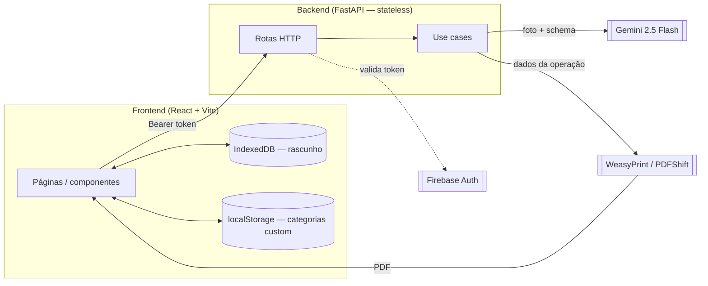
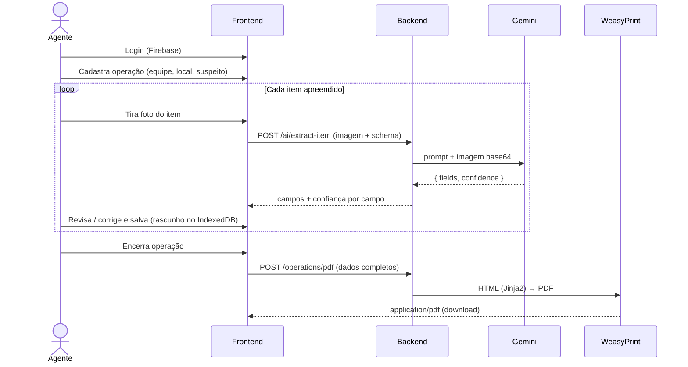
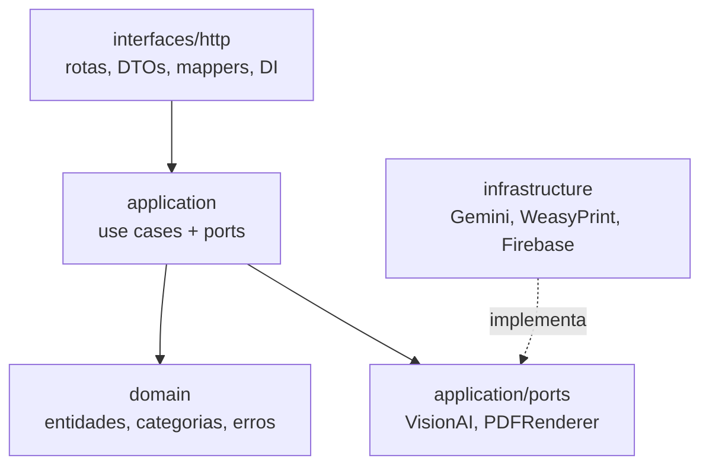

# Arquitetura

O ScanPC é um sistema **cliente/servidor sem banco de dados**: o frontend guarda o
rascunho localmente e o backend é **stateless** — cada requisição carrega tudo o que
precisa (foto, schema da categoria, dados da operação). O backend só faz duas coisas
pesadas: chamar a IA e renderizar o PDF.

## Visão geral

## Fluxo de uso

## Clean Architecture no backend

O backend segue **Clean Architecture** — dependências apontam sempre para dentro, e a
regra de negócio não conhece frameworks nem provedores externos.

- **`domain`** — regra de negócio pura, zero dependências externas.
- **`application`** — casos de uso que dependem só de **ports** (interfaces abstratas).
- **`infrastructure`** — adapters concretos que implementam os ports (Gemini, WeasyPrint, Firebase).
- **`interfaces/http`** — FastAPI, DTOs Pydantic, mappers e injeção de dependência.

O isolamento via ports (`VisionAI`, `PDFRenderer`) permite **trocar o modelo de IA ou a
biblioteca de PDF sem tocar nos casos de uso**. Detalhes em
[Backend → Camadas](backend/camadas.md).

## Decisões de projeto

- **Sem banco.** O PDF é o artefato final. O rascunho vive no dispositivo (IndexedDB),
  então fechar o navegador não perde o trabalho em campo.
- **Backend stateless.** Facilita deploy e escala; nenhuma sessão do lado servidor.
- **IA como assistente, não autoridade.** Campos sensíveis (IMEI, chassi, nº de série de
  arma) **nunca** são extraídos pela IA — o agente preenche à mão para evitar alucinação.
